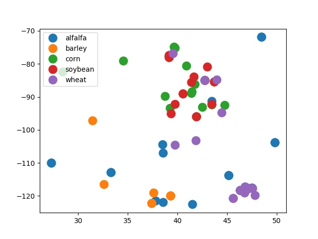

# Crop Image Processing Pipeline
---

**@author**: Shuiling Yu

## Introduction
With the increasing popularity of cellphones, farmers can take pictures of the crops, which can be used as the input of data science models to integrate more technology in to agricultural operations.

## Objectives
1. Information extraction from raw images.
2. Prepare input for deep learning model with input dimension (224, 224, 3). (Rather than develop the model)
3. Develop reproducible pipline and detailed documentation. Pipline should be extended with image augmentation techniques.
4. Visulize the location of the images, not all the images include geolocation data.

## File explanation
* Image file format:
	- Original images should be stored in `imgs_de` with crop type as the name of the subfolder
* 

## Prerequisites
* Set up [imagemagic](https://www.imagemagick.org/script/index.php) command line tools (macOS)
    ```
    brew install imagemagic
    ```
* Python packages
    * [Augmentor](https://augmentor.readthedocs.io/en/master/index.html)
    ```
    pip install Augmentor
    ```
    * Other libraries: `cv2, numpy, pandas, PIL`

## Run the program
```
cd [partent directory of imgs_de]
python3 main.py
```
The command above will run **ALL** 4 workflow steps mentioned below. For seperate run of different steps, use different arguments when running the command. If run seperately, the sequence of the different steps should be followed.

## Workflow
### Image Processing Pipeline (Resize)
Resize the original image datasets in `imgs_de` into new images with size 224\*224 to fit a convolutional neural network with input dimension (224, 224, 3):
```
python3 main.py -R
```
### Image Augmentation
Library [Augmentor](https://augmentor.readthedocs.io/en/master/index.html) is used to augment images in following ways:
* Flip
* Rotation
* Zoom
* Change brightness
* Change saturation
* Change contrast
* Image distortion

To augment and sample the images from `imgs_de_resized/`, enter in command line:
```
python3 main.py -A
```
The sample generated are stored in `imgs_de_augment/` by different types of vegetations.

Detailed augmentation setting can be changed in `augmentor()` function in `main.py`.

### Store Images in `.npy` File (Optional)
Once the images are augmented, by entering:
```
python3 main.py -S
```

The augmented images will be read in `B, G, R` channal using `cv2` and pixels are normalized into range(0, 1).

After normalization, images information are stored as `.npy` file in `imgs_npy_file`, 
which can be passed as numpy array into the machine learning model by use python script `np.load([file_name])`.

The stored numpy array is in shape `(n, 224, 224, 3)`, where `n` is the number of images in each type (i.e, corn, soybean), and the image channel sequence is `B, G, R`.

### Geolocation Mapping
Extract the geolocation metadata (for now, only the lattitude and longitude information) contained in the `Exif` of each image. 
Note that not all images include geolocation data.

By entering: 
```
python3 main.py -P
```
Geolocation information of images from `imgs_de` are saved into `imgs_map/image_geo_info.csv` in terms of:
* Lattitude
* Longitude
* Image name
* Vegation type (i.e. corn, soybean)

A map is also saved as `imgs_map/location_map.jpg`:


## Further Improvements
- [ ] Resize or save .npy file based on customized CNN dimension
- [ ] Image augementation connects with `Keras` or `Pytorch`
- [ ] Advanced augementation. `Augmentor` cannot add noise to images, other augementation methods considering weather condition (i.e. sunny, snow) can also be added using other packages.
- [ ] Train test split for dataset.
- [ ] Map points on a basemap. Right now I have trouble in installing `Basemap` package, better visualization can be achieved after the problem is solved.